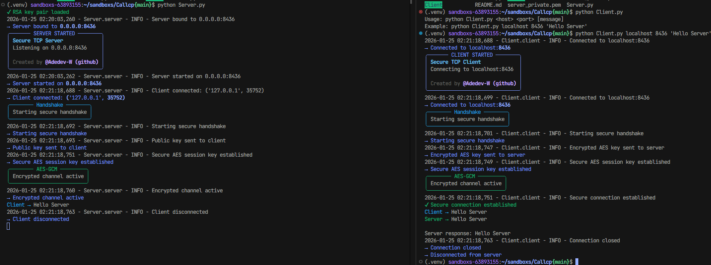

# Secure TCP Communication Library

A production-ready Python library for secure TCP communication using hybrid cryptography. This library implements RSA-2048 for secure key exchange and AES-256-GCM for authenticated encryption of all subsequent ```communications```.




## Problem Statement

Traditional TCP communication is inherently insecure, transmitting data in plaintext over the network. This exposes sensitive information to various security threats including:

- **Eavesdropping**: Unauthorized parties can intercept and read transmitted data
- **Man-in-the-Middle Attacks**: Attackers can intercept and modify communications
- **Data Tampering**: Transmitted data can be altered without detection
- **Replay Attacks**: Previously captured messages can be replayed

This library addresses these security concerns by implementing end-to-end encryption for TCP communications, ensuring that all data transmitted between client and server is encrypted and authenticated.

## Target Audience

This library is designed for:

- **Software Developers** building applications that require secure network communication
- **System Architects** implementing secure communication protocols in distributed systems
- **Security-Conscious Applications** that need to protect sensitive data in transit
- **Educational Purposes** for understanding secure communication protocols and clean architecture principles
- **Production Systems** requiring encrypted TCP communication without the overhead of TLS/SSL

The library is suitable for both development and production environments, with optional rich console UI for development and standard logging for production deployments.

## Installation

### Prerequisites

- Python 3.7 or higher
- pip package manager

### Dependencies

The library requires the following Python packages:

- `cryptography` - For cryptographic operations (RSA, AES-GCM)
- `rich` - For optional console UI enhancements (optional, can be disabled)

### Installation Steps

1. **Clone or download the repository**:
   ```bash
   git clone <repository-url>
   cd Callcp
   ```

2. **Install dependencies using pip**:
   ```bash
   pip install cryptography rich
   ```

   Or if you prefer to install from a requirements file, create `requirements.txt`:
   ```
   cryptography>=41.0.0
   rich>=13.0.0
   ```

   Then install:
   ```bash
   pip install -r requirements.txt
   ```

3. **Verify installation**:
   ```bash
   python -c "from Server import SecureTCPServer; from Client import SecureTCPClient; print('Installation successful')"
   ```

## Usage

### Basic Server Setup

Create a server instance and start listening for connections:

```python
from Server import SecureTCPServer

# Create server instance
server = SecureTCPServer(
    host="0.0.0.0",      # Listen on all interfaces
    port=8436,           # Port number
    use_display=True     # Optional: Enable Rich console UI
)

# Initialize (loads or generates RSA keys)
server.initialize()

# Start server (blocks until interrupted)
server.start()
```

### Basic Client Connection

Connect to a server and send encrypted messages:

```python
from Client import SecureTCPClient

# Create client instance
client = SecureTCPClient(
    host="localhost",    # Server address
    port=8436,          # Server port
    use_display=True    # Optional: Enable Rich console UI
)

# Connect to server (performs handshake automatically)
client.connect()

# Send message and receive response
message = b"Hello, Server!"
response = client.send_message(message)
print(f"Server response: {response.decode('utf-8')}")

# Disconnect
client.disconnect()
```

### Command Line Usage

**Start the server**:
```bash
python Server.py
```

The server will:
1. Generate RSA key pair (if not exists) and save to `server_private.pem` and `server_public.pem`
2. Bind to `0.0.0.0:8436` and start listening
3. Accept client connections and perform secure handshake
4. Handle encrypted message exchange

**Connect with client**:
```bash
python Client.py localhost 8436 "Hello from client"
```

The client will:
1. Connect to the specified server
2. Receive server's public key
3. Generate AES key and encrypt it with server's public key
4. Send encrypted AES key to server
5. Establish encrypted channel using AES-GCM
6. Send the message and receive encrypted response

### Advanced Usage: Custom Message Handler

Implement custom message processing on the server:

```python
from Server import SecureTCPServer

def custom_message_handler(message: bytes) -> bytes:
    """
    Custom message processing function.
    
    Args:
        message: Received message bytes
        
    Returns:
        Response message bytes
    """
    # Example: Convert to uppercase and add prefix
    processed = message.decode('utf-8').upper()
    response = f"Processed: {processed}"
    return response.encode('utf-8')

# Create server with custom handler
server = SecureTCPServer(
    host="0.0.0.0",
    port=8436,
    message_callback=custom_message_handler,
    use_display=False  # Disable UI for production
)

server.initialize()
server.start()
```

### Production Usage: Logging Only

For production deployments, disable the Rich display and use standard logging:

```python
import logging
from Server import SecureTCPServer

# Configure logging
logging.basicConfig(
    level=logging.INFO,
    format='%(asctime)s - %(name)s - %(levelname)s - %(message)s'
)

# Create server without display
server = SecureTCPServer(
    host="0.0.0.0",
    port=8436,
    use_display=False,  # Disable Rich UI
    logger=logging.getLogger('SecureTCPServer')
)

server.initialize()
server.start()
```

### Multiple Message Exchange

The client can send multiple messages over the same encrypted connection:

```python
from Client import SecureTCPClient

client = SecureTCPClient(host="localhost", port=8436)
client.connect()

try:
    # Send multiple messages
    messages = [
        b"Message 1",
        b"Message 2",
        b"Message 3"
    ]
    
    for msg in messages:
        response = client.send_message(msg)
        print(f"Sent: {msg.decode()}, Received: {response.decode()}")
        
finally:
    client.disconnect()
```

## Limitations and Warnings

### Security Limitations

1. **No Endpoint Authentication**: This library provides encryption but does not authenticate the identity of the server or client. An attacker could potentially perform a man-in-the-middle attack during the initial connection. For production use, consider implementing certificate-based authentication.

2. **Key Storage**: RSA private keys are stored in plaintext PEM files (`server_private.pem`). In production environments, implement additional key protection mechanisms such as:
   - Encrypted key storage
   - Hardware Security Modules (HSM)
   - Key management services

3. **No Perfect Forward Secrecy**: The same RSA key pair is used for all sessions. If the private key is compromised, all past communications could potentially be decrypted (if session keys were logged).

4. **No Replay Protection**: While AES-GCM provides authentication, the protocol does not include explicit replay attack protection beyond nonce uniqueness.

### Operational Limitations

1. **Single Client Connection**: The server implementation handles one client connection at a time. For concurrent connections, you would need to implement threading or async support.

2. **No Connection Pooling**: Each client connection requires a full handshake. For high-frequency connections, consider implementing connection pooling or session reuse.

3. **Fixed Key Size**: The implementation uses fixed key sizes (RSA-2048, AES-256). While these are secure, they cannot be easily changed without code modification.

4. **No Protocol Versioning**: The protocol does not include version negotiation. Future protocol changes may require coordinated updates.

### Performance Considerations

1. **RSA Key Exchange Overhead**: Each connection requires an RSA encryption/decryption operation, which is computationally expensive. For high-throughput scenarios, consider implementing session reuse.

2. **Memory Usage**: The library loads entire messages into memory. For very large messages, consider implementing streaming encryption.

3. **Network Overhead**: Each encrypted message includes a 12-byte nonce, adding overhead to every transmission.

### Best Practices

1. **Key Management**: Rotate RSA keys periodically and implement secure key storage in production.

2. **Error Handling**: Always implement proper error handling when using this library in production code.

3. **Logging**: Use standard Python logging for production deployments rather than console output.

4. **Network Security**: Deploy this library on secure networks or behind firewalls. The encryption protects data in transit but does not protect against network-level attacks.

5. **Testing**: Thoroughly test your implementation in a controlled environment before deploying to production.

### Known Issues

- Large public keys may require multiple socket receive operations during handshake (handled automatically)
- Connection errors may not always provide detailed diagnostic information
- The library does not handle network partitions or connection timeouts explicitly

## Architecture

For detailed architecture documentation, see [ARCHITECTURE.md](ARCHITECTURE.md).

## License

[LICENSE](LICENSE)

## Author

Created by @Adedev-W (github)


